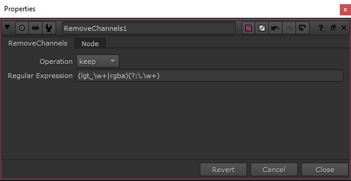

# Nuke-RemoveChannels
A plugin for the Foundry's Nuke. It allows manipulation of channels via regular expressions.

    RemoveChannels is a bit of a working name but it is what this plugin will be called for now.

RemoveChannels allows you to delete or isolate channels by the result of a C++ regex_search.

  


## Install
We added the CMake build setup to make it easier to build these plugins cross-platform on windows and linux. 
Note: after building you have to copy the resulting library file(s) to your .nuke directory or the NUKE plugin_path.<br>
If you have multiple Nuke versions or like to have a system to manage your plugins checkout: 
<a href="https://github.com/jonassorgenfrei/NukePluginManager">NukePluginManager</a>

After installing the plugin press "x" in nuke and type <i>RemoveChannels</i> to create the node.

### Linux
Install prerequisites:

```bash
sudo yum install centos-release-scl
sudo yum install devtoolset-3
sudo yum install mesa-libGLU-devel
```

Enable the devtoolset before running the bulid
```bash
# enable devtoolset-3
source /opt/rh/devtoolset-3/enable
```

Create a new directory (most often build) and run cmake from there.

```bash
mkdir build
cd build
cmake -D CMAKE_INSTALL_PREFIX="`pwd`/../install" ..
make -j X install
```

Where ```X``` is the number of cores you have available, so make can run parallelized. And, of course, update CMAKE_INSTALL_PREFIX to your preferred install location.


Note: additionally you can adjust the Nuke Version via -D Nuke_ROOT="<PATH_TO_NUKE_ROOT_FOLDER>"
Where ```<PATH_TO_NUKE_ROOT_FOLDER>``` is the path to the prefered nuke root like /usr/local/NukeXX.YvZ

e.g.
```
cmake -D CMAKE_INSTALL_PREFIX="`pwd`/../install" -D Nuke_ROOT="/usr/local/Nuke13.1v1"
```

For further information see: <a href="https://learn.foundry.com/nuke/developers/13.2/ndkdevguide/appendixa/linux.html">NDK - Dev Guide - Building on Linux</a>

### Windows

You need Visual Studio (15) 2017 on windows to compile the plugin.
You can use cmake (gui application-recommended) to create the project files for Visual Studio.<br>
Note: make sure to use the x64 platform to compile the plugin. 

If you want to build the tool via command line (or via batch script) use:
```
mkdir build
cd build
cmake -G "Visual Studio 15 2017" -A x64 .. -DCMAKE_INSTALL_PREFIX=../install -B build
cmake --build build --config Release
cmake --install build
```

Note: additionally you can adjust the Nuke Version via -D Nuke_ROOT="<PATH_TO_NUKE_ROOT_FOLDER>"
Where ```<PATH_TO_NUKE_ROOT_FOLDER>``` is the path to the prefered nuke root like C:/Programs/NukeXX.YvZ

e.g.
```
mkdir build
cd build
cmake -G "Visual Studio 15 2017" -A x64 .. -D CMAKE_INSTALL_PREFIX=../install -D Nuke_ROOT="C:/Program Files/Nuke13.1v1" -B build
cmake --build build --config Release
cmake --install build
```
For further information see: <a href="https://learn.foundry.com/nuke/developers/13.2/ndkdevguide/appendixa/windows.html">NDK - Dev Guide - Building on Windows</a>

## Batch Install
We provide an install batch script to compile RemoveChannels for multiple versions of Nuke which works on linux and windows and 
creates the compiled plugins in the choosen install folder for every version. 
The script can be executed running batchInstall.sh, you can then enter the Path to search for Nuke Versions e.g. /usr/local/ or C:/Program Files
Optionally an install path can be entered aswell. The script then runs and compiles the plugins (as far as the dependencies like compilers can be found).

## Supported Platforms:
    
<b>These are the only tested platforms so far.</b>
* Windows 7 and greater with Nuke 9.0
* Windows 7 and greater with Nuke 10.0
* Windows 7 and greater with Nuke 10.5
* Windows 10 and greater with Nuke 12.0
* Windows 10 and greater with Nuke 12.0
* Windows 10 and greater with Nuke 13.0
* Windows 10 and greater with Nuke 13.1
* Windows 11 and greater with Nuke 12.2


## Examples
We added the sample nuke file from the screen shot above in the examples folder for you to test it out espacially if you build and installed it correctly.

## Extra Information
Some help links for regex:

*    https://en.wikipedia.org/wiki/Regular_expression
*    http://stackoverflow.com/questions/4736/learning-regular-expressions
*    https://www.quora.com/Regular-Expressions-computing/What-are-the-best-resources-for-learning-RegEx
*   https://www.quora.com/What-are-the-best-resources-for-learning-regular-expressions
